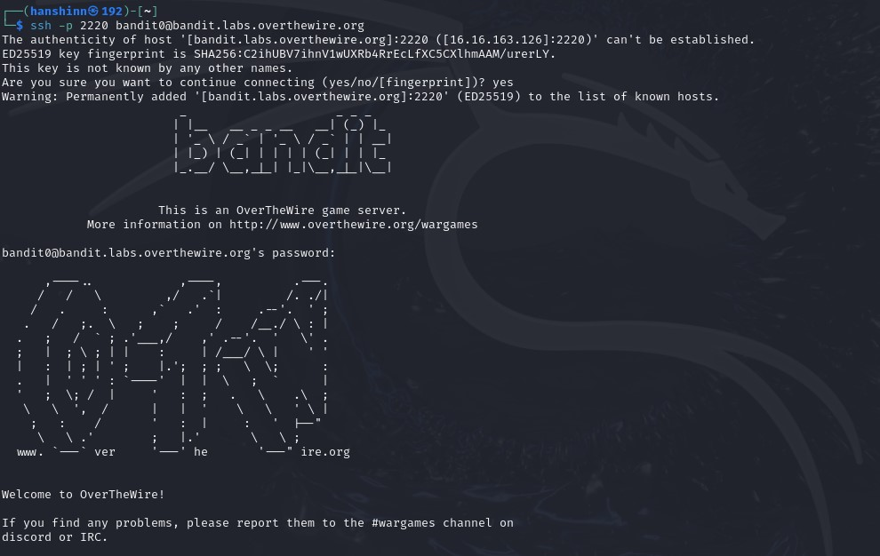
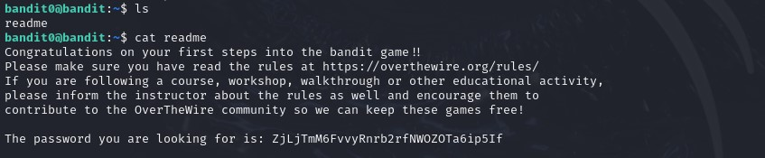
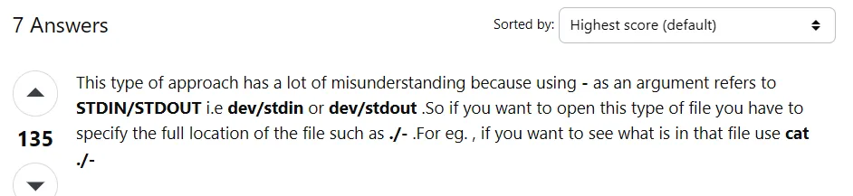
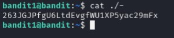
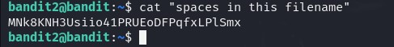
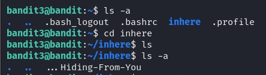

## Level 0 - Logging In

> ❓Description

Log into the game using SSH.  
Host to be connected: bandit.labs.overthewire.org  
Port: 2220  

username: *bandit0*  
password: *bandit0*

> 📔Study

`ssh` is a program for logging into remote machine and also executing commands on remote machines. The objective of it is to provide secure and encrypted communications between two hosts, in this case, my pc and bandit server!

> 💡 Solution

I run `ssh -p 2220 bandit0@bandit.labs.overthewire.org` in my Linux terminal to ssh into the machine



`-p 2220` means specifying the port to connect  
each level in bandit is formatted in "bandit\<level>", in this case **bandit0**

## Level 1 - Read a File
> ❓Description

The password for the next level is stored in a file called - located in the home directory

> 📔Study

**Tip**: to quickly understand the details usage of command we can use `man` command.


From above `man` command will basically list down the information and the flags that can be specified.

<br>

---
Anyways, here we study some of the basic Linux commands that involve accessing contents from directories and files.  
- `pwd` ➡ short for "print working directory", it displays the full path of your current dir in Linux. Also we can easily view it on the left next to the username. Exp. `bandit0@bandit:~$`, here the ~ indicates the current working directory as the home directory of the user.
- `ls` ➡ one of the most used command, `ls` is used to list the contents of a directory, user is able to show files and directories. Below I list down some common options;  
🚩`-a`: Lists all files, including hidden ones (those starting with a ".").   
🚩`-l`: Lists files in a long format, providing detailed information.   
🚩`-R`: Recursively lists the contents of subdirectories.   
🚩`-t`: Sorts files by modification time (newest first).   
🚩`-r`: Reverses the order of the output (e.g., from newest to oldest).   
🚩`-h`: Displays file sizes in a human-readable format (e.g., KB, MB).   
🚩`-d`: Lists the directory itself instead of its contents.   
🚩`-1`: Lists one file per line.    
- `cat` ➡ used for user to display, concatenate and create files in their terminal.
  - `cat my_file.txt` - print out file content
  - `cat file1.txt file2.txt > combined.txt` - combine both file content into combined.txt
  - `cat > new_file.txt` - create new file!

> 💡 Solution



There is a readme file in the directory, using `cat` to print the content, and here is the flag :)

## Level 2 - Special Character Filename

> ❓Description

The password for the next level is stored in a file called spaces in this filename located in the home directory

> 📔Study

Since "-" is a special symbol (**Standard Option Character**) in Linux, it is also not recommended to start any filename with this symbol.

> 💡 Solution

To read "-" file, `cat -` cant work

From this answer we know that to read this file with a special name, specify the full path:  


## Level 3 - Spaces in Filename

> ❓Description

The password for the next level is stored in a file called spaces in this filename located in the home directory

> 📔Study

Besides "-", " " spaces in filename is also not encouraged:

```bash
bandit2@bandit:~$ cat spaces in this filename
cat: spaces: No such file or directory
cat: in: No such file or directory
cat: this: No such file or directory
cat: filename: No such file or directory
```

We can see that the terminal interpret the **spaces as a new additional file name/command**.  
Hence, to add spacial effect use:  
✅ underscore ( _ )  
✅ dash (-)

> 💡 Solution

To allow the terminal to interpret the filename as a single file I use `" "`  


## Level 4 - Hidden Stuff

> ❓Description

The password for the next level is stored in a hidden file in the inhere directory

> 💡 Solution

As seen in [study note](#level-1---read-a-file), since `inhere` is a hidden directory we use flag -a to show all directory:


**Observation**  
🟡 upon entering the directory, using `ls` shoes nothing too...  
🟡 using -a flag again we finally found the file with password

```bash
bandit3@bandit:~/inhere$ cat ...Hiding-From-You
2WmrDFRmJIq3IPxneAaMGhap0pFhF3NJ
```
