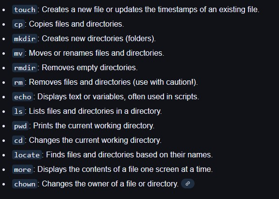
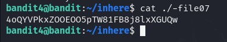
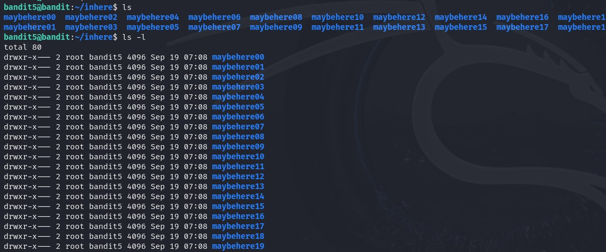
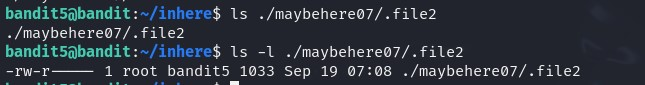
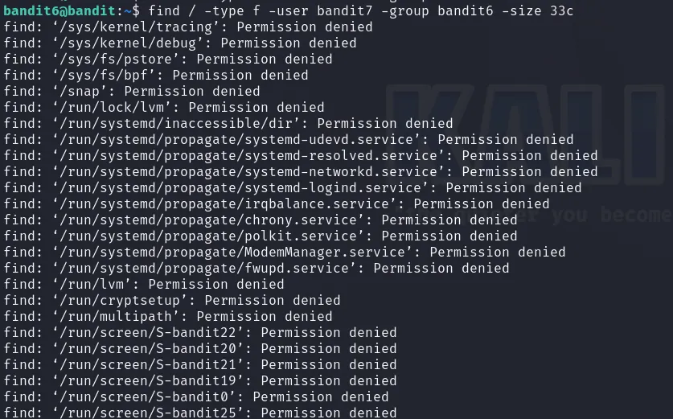
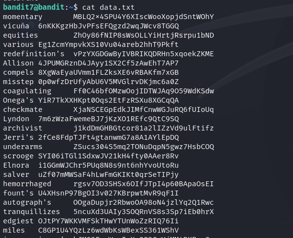
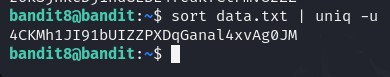

## Level 5 - File Contents

> ❓Description  

The password for the next level is stored in the only human-readable file in the inhere directory. Tip: if your terminal is messed up, try the “reset” command.

> 📔Study

we study into `file` command:
- used to identify the type of file by **examining its content** rather than extension
- Displays a human-readable format *(e.g., "ASCII text")* or a MIME type *(e.g., "text/plain; charset=us-ascii")*.

Since we are at file commands:


> 💡 Solution

In the description we are hinted on **only human-readable** file, we use `file` command

```console
bandit4@bandit:~/inhere$ file ./*
./-file00: data
./-file01: data
./-file02: data
./-file03: data
./-file04: data
./-file05: data
./-file06: data
./-file07: ASCII text
./-file08: data
./-file09: data
```

Got it✅  


<br>

## Level 6 - A Specific File

> ❓Description  

The password for the next level is stored somewhere on the server and has all of the following properties:

- owned by user bandit7  
- owned by group bandit6  
- 33 bytes in size  

> 📔Study

`find` command is a very powerful tool provided by Linux, offering a wide array of options for searching files and directories

Now we look into the basic options that make this command powerful:  
- `-name`  
  Searches for files and directories matching a specific name pattern (case-sensitive).   
  💡 `find . -name "example.txt"` Searches the **current and subdirectories** for a file named "example.txt". 
- `-iname`  
  Case-insensitive version of "-name"  
  💡 `find . -iname "example.txt"`: Searches for "example.txt" regardless of case.
- `-type`  
  Specifies the type of file to search for (e.g., **f** for regular files, **d** for directories).   
  💡 `find . -type f`: Finds all regular files in the current directory.
-  `-path`  
  Searches for files or directories whose full path matches the pattern  
  💡 `find /home -path "/home/user/documents/*"`: Searches for files in the */home/user/* documents directory. 
- `-size`  
  Finds files of a specific size  
  💡 `find . -size +10M`: Finds all files larger than 10MB. 
- `-user`  
  Finds files owned by a specific user.  
  💡 `find . -user john`: Finds all files owned by the user "john".
- `-group`  
  Finds files belonging to a specific group.  
  💡 `find . -group staff`: Finds all files belonging to the group "staff".   
- `-perm`  
  Finds files with specific permissions.
  💡 `find . -perm 755`: Finds all files with read, write, and execute permissions for owner, group, and others.

> 💡 Solution

Let's see what is in the directory



Since there is a lot of folders, it is not really feasible to cd into them one by one, let's directly `find`  



Found it! Just not sure why it says here owned by bandit5 but not 6 lol.

```bash
bandit5@bandit:~/inhere$ cat ./maybehere07/.file2
HWasnPhtq9AVKe0dmk45nxy20cvUa6EG
```

## Level 7 - No Permission

> ❓Description

The password for the next level is stored somewhere on the server and has all of the following properties:

- owned by user bandit7  
- owned by group bandit6  
- 33 bytes in size

> 📔Study

We look into [**file permission**](https://linuxjourney.com/lesson/file-permissions), which is the fundamental concept in Linux system:

Take an example:  
```console
drwxr-xr-x  1 john staff 3771 Mar 31  2024 .bashrc
```
john (third column) - user  
staff(forth column) - group

Breaking down  `d | rwx | r-x | r-x `  
-  `d` indicates filetypd - in this case **d** irectory. If for regular file is `a`  
-  Permissions are groups into 3 bits each - user | group | other
-  Permission glossary:
   - `r`: readable
   - `w`: writable
   - `x`: executable (basically an executable program)
   - `-`: empty

> 💡 Solution

We try finding



Seems like there were a bunch of files across server fitting to the criteria, but we don't have access...


  What's the difference of find `.` and find `/` ?  
  Ans: `find .` means you want to find files based on current directory;  
  `find /` means you want to find from root directory.  
  `find *` means "start with the visible contents of the directory". A depth of 0 will be each of the visible items in the directory.


To remove the noise of **Permission denied** error, we append `2>/dev/null`  
This redirects any error messages (standard error stream) to /dev/null, effectively discarding them. This is useful for ignoring permission errors or other issues that might occur during the search.


  What are the types of errors?  
  Ans: Every program we run on the command line automatically has three data streams connected to it.

- **STDIN (0)** - Standard input (data fed into the program)
- **STDOUT (1)** - Standard output (data printed by the program, defaults to the terminal)
- **STDERR (2)** - Standard error (for error messages, also defaults to the terminal)


Coming back  
```console
bandit6@bandit:~$ find / -type f -user bandit7 -group bandit6 -size 33c 2>/dev/null
/var/lib/dpkg/info/bandit7.password

bandit6@bandit:~$ cat /var/lib/dpkg/info/bandit7.password
morbNTDkSW6jIlUc0ymOdMaLnOlFVAaj
```

## Level 8 - Find a word

> ❓Description

The password for the next level is stored in the file data.txt next to the word millionth

> 📔Study

How to find certain word/text in a file?  
👍🏼`grep` command👍🏼  

Example: `grep "error" logfile.txt` ➡ searches for lines containing "error" in logfile.txt

| Option                  	| Key        	| Feature                                                       	|
|-------------------------	|------------	|---------------------------------------------------------------	|
| Case-insensitive search 	| `-i`         	| for case-insensitive searching                                	|
| Recursive Search        	| `-r`         	| searching recursively with directories                        	|
| Line Number             	| `-n`         	| to display the line number with matching line                 	|
| Count Matches           	| `-c`         	| count the number of matching lines                            	|
| Invert Match            	| `-v`         	| to display lines that don't match the pattern                 	|
| Exact Match             	| `-w`         	| find exact word matches                                       	|
| Context                 	| `-A, -B, -C` 	| display lines before, after, or both around the matching line 	|

> 💡 Solution

We can see data.txt is wayyyy too large for us to search manually



use grep:
```console
bandit7@bandit:~$ grep "millionth" data.txt
millionth       dfwvzFQi4mU0wfNbFOe9RoWskMLg7eEc
```

## Level 9 - Only once

> ❓Description

The password for the next level is stored in the file data.txt and is the only line of text that occurs only once

> 📔Study

The `uniq` command in Linux is used to filter out or report repeated lines in a file. It is commonly used in conjunction with the `sort` command because `uniq` only detects duplicate lines that are adjacent. Therefore, for the most effective use, lines should be sorted before using `uniq`.

> 💡 Solution

  
the `-u` only outputs lines that are unique in the input