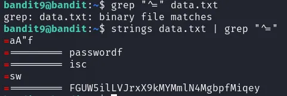
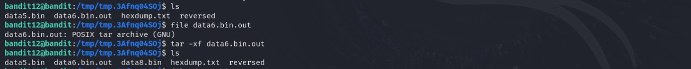
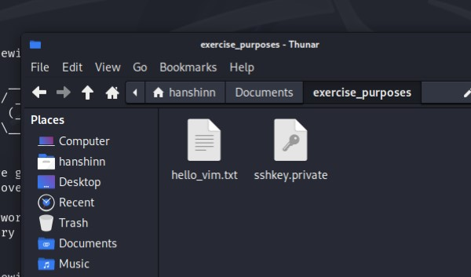
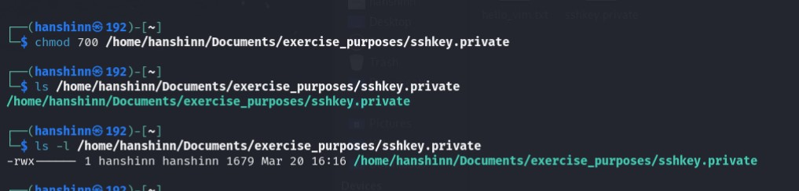

## Level 10 - Human readable strings

> ❓Description  

The password for the next level is stored in the file data.txt in one of the few human-readable strings, preceded by several ‘=’ characters.

<br>

---
> 📔Study

The `strings` command is designed to find and print sequences of printable characters (strings) within a file, particularly useful when dealing with binary files that might contain embedded text.

<br>

---
> 💡 Solution


We can see that data.txt contains binary matches when trying to `grep`

Hence, we can you `strings` to filter out the printable char in the file

## Level 11 - Base64 coded

> ❓Description  

The password for the next level is stored in the file data.txt, which contains base64 encoded data.

<br>

---
> 📔Study

Since I have been constantly encountering it, let's take this good chance to have a more comprehensive understanding of **base64 Encoding** 

Base64 is an encoding scheme that transforms binary data ➡ printable chracters.

🤔 WHY USE IT?  
- some systems are restricted to ASCII characters
- some characters having meaning that might differ from system to system

<br>

🤔 WHEN TO USE IT?  
- imcompatible data is transmitted through network (eg. image attachement in emails)
- imcompatible data needs to be stored in files or cookies, etc.


  base64 is actually costly instrument - **33%** larger of memory consumption. Hence despite of its usefulness, only use it when necessary


<br>

Coming back to **base64 command in linux** 😯  
1. encoding
   ```console
   $ echo -n 'Hello, World!' | base64
    SGVsbG8sIFdvcmxkIQ==
   ```

2. decoding
   ```console
   $ base64 -d <<< SGVsbG8sIFdvcmxkIQo=
   Hello, World!
   ```


<br>

---
> 💡 Solution

Let's look into data.txt raw content:

```console
bandit10@bandit:~$ cat data.txt
VGhlIHBhc3N3b3JkIGlzIGR0UjE3M2ZaS2IwUlJzREZTR3NnMlJXbnBOVmozcVJyCg==
```


As you can tell base64 encoded string ends in `==`


<br>

now, use base64 command to decode this  
```console
bandit10@bandit:~$ base64 -d <<< cat data.txt
The password is dtR173fZKb0RRsDFSGsg2RWnpNVj3qRr
```

## Level 12 - ROT13
> ❓Description  

The password for the next level is stored in the file data.txt, where all lowercase (a-z) and uppercase (A-Z) letters have been rotated by 13 positions

<br>

---
> 📔Study

[ROT13](https://en.wikipedia.org/wiki/ROT13) is a simple letter substitution cipher that replaces a letter with the 13th letter after it in the Latin alphabet.

One of the earliest form of crytography as it is developed way back in ancient Rome ;p

<br>

---
> 💡 Solution


## Level 13 - Hexdump

> ❓Description  

The password for the next level is stored in the file data.txt, which is a hexdump of a file that has been repeatedly compressed. For this level it may be useful to create a directory under /tmp in which you can work. Use mkdir with a hard to guess directory name. Or better, use the command “mktemp -d”. Then copy the datafile using cp, and rename it using mv (read the manpages!)

<br>

---

> 📔Study

**File signature**

📁 is a unique dequence of bytes at the beginning of a file that identifies its format,even if the file extension is missing/incorrect  
📁 You can find these signature at the beginning of the file  
&nbsp; &nbsp; &nbsp; Example   
&nbsp; &nbsp; &nbsp; - JEPG file: `FF D8 FF E0`  
&nbsp; &nbsp; &nbsp; - PDF file: `25 50 44 46`  
&nbsp; &nbsp; &nbsp; - Windows exec file: `4D 5A`  
📁We can analyse file signature by **comparing the digital signatures** of files against a database of known malicious signatures to identify and flag potentially harmful or suspicious files. 


  
  Why is file signature important  
  - for computer to determine the correct application to open a file
  - ensure data integrity from corruption or tampering
  - use to [identify and prevent malware ](https://cyberpedia.reasonlabs.com/EN/file%20signature%20analysis.html)  


<br>


**HexDumps**  
🔢is a textual representation of computar data (typically binary), in hexdecimal format

🔢How to read
```bash
    00000000  48 65 6c 6c 6f 20 77 6f 72 6c 64 21  Hello world!
```
- `00000000` is the hexadecimal address.  
- `48 65 6c 6c 6f 20 77 6f 72 6c 64 21` are the hexadecimal values of the bytes.  
- `Hello world!` is the ASCII representation of the bytes.  
  
🔢`xxd` command
- used for creating and analyzing hexadecimal dumps from files
- example
  - `xxd hello.txt > hexdump.txt`: converting hello.txt into hexdump and store in hexdump.txt
  - `xxd -r hexdump.txt > reversed.txt`: reverse back

<br>

---

> 💡 Solution  

This is a hard level 💀 Let's break down into steps for easier intepretation.

**STEP 1: MAKE TEMP DIR**

As advised I create a temporary directory to store the files in the process of solving, using `mktemp` 


Then copy `cp` data.txt from home directory and rename it `mv` for easier refence

**STEP 2: GZIP FILE**

First inspect the hexdump file, we can [idenitfy the file signature](https://en.wikipedia.org/wiki/List_of_file_signatures) `1f8b`   
  
By looking up the list of file signature, we can recognize that the file is a `gzip` file, what we have to do is decompress it.  


In order to decompress, we first have to reverse hexdump.txt and rename the right extension to reverse
```bash
bandit12@bandit:/tmp/tmp.3Afnq04SOj$ xxd -r hexdump.txt reversed
bandit12@bandit:/tmp/tmp.3Afnq04SOj$ ls
hexdump.txt  reversed
bandit12@bandit:/tmp/tmp.3Afnq04SOj$ mv reversed reversed.gz    # rename with right extension
```

By decompressing reversed.gz using `gzip -d` we get  


Let's hexdump view of our decompressed file, we get `425a` file signature, by checking up  


**STEP 3: BZIP2 FILE**

Follow the same procedure~  
✅ rename to right extension: `mv reversed reversed.bz2`  
✅ decompres: `bzip2 -d reversed.bz2`  
✅ inspect the new file: `cat`  
✅ check for file signature: `xxd reversed `


hmm... seems like another gzip file

**STEP 4: ANOTHER GZIP FILE**

same process, we get

we can see data5.bin appearing, and 6461 seems to not be in the list...  
Maybe I can try using `file` command to inspect

**STEP 5: TAR ARCHIVE**

Got it, the reversed file is a tar achieve object  

By decompressing it with `tar -xvf reversed`, we see data5.bin being extracted out  
Repeat it with data5.bin comes out data6.bin (it's a rabit hole legit😣)

**STEP 6: ANOTHER TAR ARCHIVE**  
By checking the content of data6.bin, still doesn't look right (haih) 


So, continue extracting data6.bin (out of words)

Discovering data8.bin (yay)

**STEP 6: LAST GZIP FILE**  
Using `file` command we know data8 is gzip, just decompress


👏🏼👏🏼👏🏼GET


You can determine that it will likely be one of those formats by looking at the first few bytes. You should then test to see if it is one of those, using an integrity check from the associated utility for that format, or by actually proceeding to decompress.



## Level 14 - COPY PRIVATE KEY TO LOCAL

> ❓Description  

The password for the next level is stored in /etc/bandit_pass/bandit14 and can only be read by user bandit14. For this level, you don’t get the next password, but you get a private SSH key that can be used to log into the next level. Note: localhost is a hostname that refers to the machine you are working on

<br>

---

> 📔Study

If we want to transfer files from remote host to local host, how do we do? 🤔  
Ans: `scp` command

**Secure Copy (scp)**  
- used for securely transferring files between a local and remote system, or between two remote systems, using SSH for encryption and authentication

Syntax:  
```bash
scp [options] [[user@]src_host:]file1 [[user@]dest_host:]file2
```
- `[options]`: flags to customize the command  
- `[user@]src_host:`: Specifies the source host (IP address or domain name) and optionally the username for authentication.   
- `file1`: The file or directory to be copied from the source.   
- `[[user@]dest_host:]file2`: Specifies the destination host and optionally the username for authentication, and the destination path or filename.   

Flags:  
🚩`-r`: Recursively copies entire directories and their contents.  
🚩`-P <port>`: Specifies the port number to use for the SSH connection.  
🚩`-i <identity_file>`: Uses a specific private key file for authentication instead of the default SSH key.  
🚩`-p`: Preserves modification times, access times, and ownership.

<br>

---

> 💡 Solution  

Basically in the description we know the key to log into next level is using [private SSH key](https://jumpcloud.com/blog/what-are-ssh-keys), unlike other levels' password authentication approach.

Now transfer the `sshkey.private` from the remote server to our local machine:

```bash
$ scp -P 2220 bandit13@bandit.labs.overthewire.org:sshkey.private .         
This is a OverTheWire game server. More information on http://www.overthewire.org/wargames

bandit13@bandit.labs.overthewire.org's password: 
sshkey.private  
```
Now the file is in my local file system


Now I tried logging in the next level using the copied private key file, but getting below error


Permissions are too open, as said. Now I have to reduce the permissions with `chmod` command:



With `chmod 700`, I basically limit read write execute permission to **only for owner**

Now use ssh with `-i` option to log in

```bash
$ ssh -i sshkey.private bandit14@bandit.labs.overthewire.org -p 2220
```
