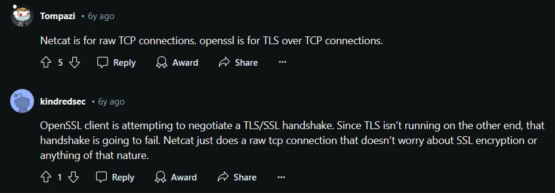
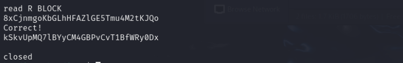

## Level 15 - Sending Message to Port

> ❓Description  

The password for the next level can be retrieved by submitting the password of the current level to port 30000 on localhost.

<br>

---
> 📔Study

Since we are at server-machine communication, it's a good establishment on looking into network terminologies

🌐 IP address:  
.. is a numerical label assigned to device connected to computer network  
.. functions -> network interface identification, and location addressing

🌐 localhost:  
.. a hostname that refers to the current computer used to access it  
.. IPv4 network standards reserve the entire address block 127.0.0.0/8 for loopback purposes  
.. 127.0.0.1 is the standard address for IPv4 loopback traffic

🌐 ports:  
.. each port is assigned for certain service that the server provide  
.. some common port numbers /[source](https://opensource.com/article/18/10/common-network-ports)


In terms of **network communication**, there is an important "swiss army knife" the handy command:  
Netcat `nc`  

`nc` functions include:
- network communication (establish TCP UDP connections)
- port scanning
- file transfer
- network debugging
- port listening
- simple chat room

syntax:
```bash
nc [options] <host> <port>
```

options:  
🚩`-u`: Use UDP instead of TCP.   
🚩`-v`: Enable verbose mode for more detailed output.   
🚩`-z`: Enable zero-I/O mode (used for scanning ports).   
🚩`-e <command>`: Execute a command on the remote host when a connection is established (advanced use).   
🚩`-p` "port": Specify the source port to use.   
🚩`--source` "host": Specify the source IP address.   
🚩`-g <hop1, hop2,...>`: Set the source routing path.   
<br>

---
> 💡 Solution

The key task here, is to communicate with a dedicated port - 30000.


From above;  
1. Find password for bandit14 level, we can find in the directory specified in [level 14](part-4.md) which is `/etc/bandit_pass/bandit14`
2. Echo the password after establishing `nc` connection, as mentioned above the default address for localhost is `127.0.0.1`


## Level 16 - Secure Connection with SSL

> ❓Description  

The password for the next level can be retrieved by submitting the password of the current level to port 30000 on localhost.

<br>

---
> 📔Study

🔐 **OpenSLL**  
is a cryptographic library that enables an open source implementation of Transport Layer Security (TLS) and Secure Sockets Layer (SSL) protocols


It's function includes
- encrypt data
- certificate management
- secure web server deployment
- random numer generation


  What is the difference between netcat and OpenSSL s_client?



---
> 💡 Solution

Establish secure connection using openSSL with `openssl` command

```bash
openssl s_client -connect localhost:30001
```
By sending the password for current level, the server then responds back with password for next level:)\



## Level 17 - 

> ❓Description  

The credentials for the next level can be retrieved by submitting the password of the current level to a port on localhost in the range 31000 to 32000. First find out which of these ports have a server listening on them. Then find out which of those speak SSL/TLS and which don’t. There is only 1 server that will give the next credentials, the others will simply send back to you whatever you send to it.

<br>

---
> 📔Study

This level involves 🔍port scanning🔍

**Port scanning** is a technique used to identify which ports on a target server are open, which indicate potential vulnerabilities and services running on those ports.

How the scanning works?  
- Port scanners send packets to a range of ports (0-65535) and analyze the responses to determine which ports are open, closed, or filtered.   
- Open ports indicate that a service or application is listening on that port, while closed ports indicate that no service is listening. 
- Filtered ports indicate that a firewall or other security device is blocking access to those ports. 

Some common port scanning tools include: Nmap, Netcat, PortSentry, etc

We dive more into **Network Mapper**, famously known as `nmap`~  
It offers a lot of advantages:  
- quickly recognize the devices (like servers, routers, switches, etc)on single or multiple networks
- identify services running on a system
- detect application versions to detect existing vulnerabilities
- find info about the operating system running

Read more in [Nmap Commands Cheat Sheet](https://stationx-public-download.s3.us-west-2.amazonaws.com/nmap_cheet_sheet_v7.pdf)

