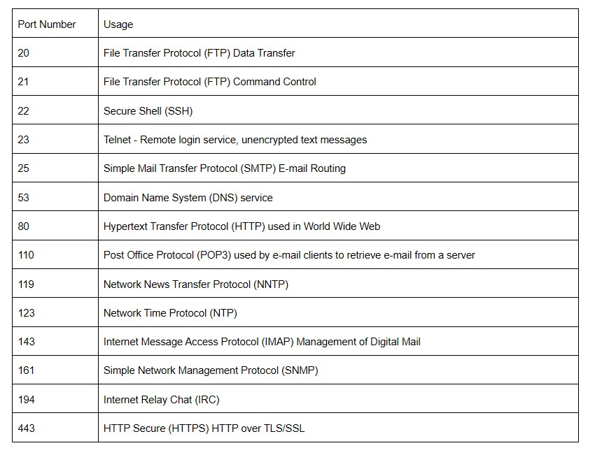
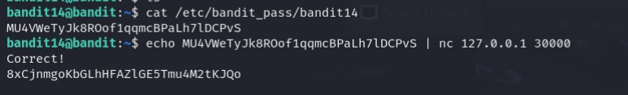

## Level 15 - Sending Message to Port

> ❓Description  

The password for the next level can be retrieved by submitting the password of the current level to port 30000 on localhost.

<br>

---
> 📔Study

Since we are at server-machine communication, it's a good establishment on looking into network terminologies

🌐 IP address:  
.. is a numerical label assigned to device connected to computer network  
.. functions -> network interface identification, and location addressing

🌐 localhost:  
.. a hostname that refers to the current computer used to access it  
.. IPv4 network standards reserve the entire address block 127.0.0.0/8 for loopback purposes  
.. 127.0.0.1 is the standard address for IPv4 loopback traffic

🌐 ports:  
.. each port is assigned for certain service that the server provide  
.. some common port numbers /[source](https://opensource.com/article/18/10/common-network-ports)



In terms of **network communication**, there is an important "swiss army knife" the handy command:  
Netcat `nc`  

`nc` functions include:
- network communication (establish TCP UDP connections)
- port scanning
- file transfer
- network debugging
- port listening
- simple chat room

syntax:
```bash
nc [options] <host> <port>
```

options:  
🚩`-u`: Use UDP instead of TCP.   
🚩`-v`: Enable verbose mode for more detailed output.   
🚩`-z`: Enable zero-I/O mode (used for scanning ports).   
🚩`-e <command>`: Execute a command on the remote host when a connection is established (advanced use).   
🚩`-p` "port": Specify the source port to use.   
🚩`--source` "host": Specify the source IP address.   
🚩`-g <hop1, hop2,...>`: Set the source routing path.   
<br>

---
> 💡 Solution

The key task here, is to communicate with a dedicated port - 30000.



From above;  
1. Find password for bandit14 level, we can find in the directory specified in [level 14](part-4.md) which is `/etc/bandit_pass/bandit14`
2. Echo the password after establishing `nc` connection, as mentioned above the default address for localhost is `127.0.0.1`


## Level 15 - Sending Message to Port

> ❓Description  

The password for the next level can be retrieved by submitting the password of the current level to port 30000 on localhost.

<br>

---
> 📔Study
